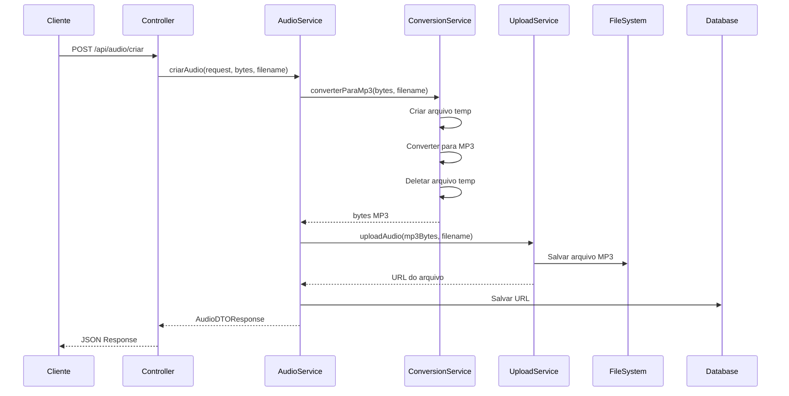

# 🎵 Sistema de Upload de Áudio - Documentação Completa

## ✅ Status da Implementação

**Data:** 21/11/2025  
**Status:** ✅ COMPLETO E FUNCIONAL  
**Padrão:** Implementado seguindo o mesmo padrão do upload de imagens

---

## 📦 Componentes Implementados

### 1️⃣ **AudioConversionService** ✅
**Arquivo:** `src/main/java/com/voulerparavoce/service/AudioConversionService.java`

**Responsabilidades:**
- ✅ Converter arquivos de áudio para formato MP3
- ✅ Suportar múltiplos formatos de entrada (WAV, FLAC, OGG, M4A, AAC, etc.)
- ✅ Otimizar com arquivos temporários
- ✅ Retornar arquivo original se já for MP3

**Configurações de Conversão:**
- Codec: `libmp3lame`
- BitRate: `128 kbps`
- Canais: `2 (Stereo)`
- Sampling Rate: `44100 Hz (44.1 kHz)`

**Tecnologia:** JAVE2 (Java wrapper para FFmpeg)

---

### 2️⃣ **AudioUploadService** ✅
**Arquivo:** `src/main/java/com/voulerparavoce/service/AudioUploadService.java`

**Responsabilidades:**
- ✅ Salvar arquivos MP3 no sistema de arquivos
- ✅ Gerar nomes únicos com UUID
- ✅ Gerenciar diretório de upload
- ✅ Suportar operações de upload, atualização e deleção

**Diretório:** `src/main/resources/static/audios/`  
**URL Pattern:** `/audios/{uuid}.mp3`

---

### 3️⃣ **AudioService** ✅
**Arquivo:** `src/main/java/com/voulerparavoce/service/AudioService.java`

**Responsabilidades:**
- ✅ Orquestrar o processo de criação de áudio
- ✅ Validar usuário e história
- ✅ Coordenar conversão + upload
- ✅ Persistir dados no banco

**Fluxo:**
```
Arquivo → Conversão MP3 → Upload → Salvar URL no BD → Response
```

---

### 4️⃣ **AudioController** ✅
**Arquivo:** `src/main/java/com/voulerparavoce/controller/AudioController.java`

**Endpoint:** `POST /api/audio/criar`  
**Content-Type:** `multipart/form-data`

**Parâmetros:**
- `dados` (JSON string): `{ ordem, usuarioId, historiaId }`
- `arquivo` (MultipartFile): Arquivo de áudio

---

## 📁 Estrutura de Diretórios

```
backend/
├── src/
│   ├── main/
│   │   ├── java/com/voulerparavoce/
│   │   │   ├── controller/
│   │   │   │   └── AudioController.java ✅
│   │   │   └── service/
│   │   │       ├── AudioConversionService.java ✅ NOVO
│   │   │       ├── AudioUploadService.java ✅ NOVO
│   │   │       └── AudioService.java ✅ ATUALIZADO
│   │   └── resources/
│   │       ├── application.properties ✅ ATUALIZADO
│   │       └── static/
│   │           ├── audios/ ✅ NOVO
│   │           │   └── {uuid}.mp3
│   │           └── imagens/
│   │               └── {uuid}.{ext}
│   └── test/
│       └── java/com/voulerparavoce/
│           └── AudioUploadIntegrationTest.java ✅ NOVO
├── pom.xml ✅ ATUALIZADO
├── AUDIO_UPLOAD_README.md ✅ NOVO
└── EXEMPLOS_USO_API_AUDIO.md ✅ NOVO
```

---

## 🔧 Configurações

### pom.xml
```xml
<!-- JAVE2 para conversão de áudio -->
<dependency>
    <groupId>ws.schild</groupId>
    <artifactId>jave-core</artifactId>
    <version>3.5.0</version>
</dependency>
<dependency>
    <groupId>ws.schild</groupId>
    <artifactId>jave-nativebin-win64</artifactId>
    <version>3.5.0</version>
</dependency>
<dependency>
    <groupId>ws.schild</groupId>
    <artifactId>jave-nativebin-linux64</artifactId>
    <version>3.5.0</version>
</dependency>
```

### application.properties
```properties
spring.servlet.multipart.max-file-size=50MB
spring.servlet.multipart.max-request-size=50MB
```

---

## 🚀 Como Usar

### 1. Frontend - JavaScript/React
```javascript
const formData = new FormData();

const dados = {
  ordem: 1,
  usuarioId: 123,
  historiaId: 456
};

formData.append('dados', JSON.stringify(dados));
formData.append('arquivo', audioFile);

const response = await fetch('http://localhost:8080/api/audio/criar', {
  method: 'POST',
  headers: {
    'Authorization': `Bearer ${token}`
  },
  body: formData
});

const resultado = await response.json();
console.log('URL:', resultado.audio); // "/audios/{uuid}.mp3"
```

### 2. Acessar o Áudio
```javascript
// URL completa do áudio
const audioUrl = `http://localhost:8080${resultado.audio}`;

// Usar em elemento de áudio HTML
<audio controls src={audioUrl}></audio>
```

### 3. Exemplo cURL
```bash
curl -X POST http://localhost:8080/api/audio/criar \
  -H "Authorization: Bearer TOKEN" \
  -F "dados={\"ordem\":1,\"usuarioId\":123,\"historiaId\":456}" \
  -F "arquivo=@audio.wav"
```

---

## 📊 Fluxo Completo



---

## 🎯 Formatos Suportados

### Entrada (Convertidos para MP3)
- ✅ WAV
- ✅ FLAC
- ✅ OGG
- ✅ M4A
- ✅ AAC
- ✅ WMA
- ✅ MP3 (sem conversão)
- ✅ Outros formatos FFmpeg

### Saída
- 🎵 MP3 (128 kbps, Stereo, 44.1 kHz)

---

## 📝 Response da API

```json
{
  "id": 1,
  "ordem": 1,
  "audio": "/audios/abc123-def456-ghi789.mp3",
  "status": 1,
  "usuarioId": 123,
  "historiaId": 456,
  "dataCriacao": "2025-11-21T10:30:00"
}
```

---

## ⚡ Performance

### Otimizações Implementadas
- ✅ Arquivos temporários são removidos automaticamente
- ✅ Se arquivo já é MP3, não há conversão
- ✅ Diretório criado automaticamente se não existir
- ✅ Nomes únicos evitam conflitos

### Considerações
- ⏱️ Conversão pode demorar para arquivos grandes (10+ MB)
- 💡 Considere processamento assíncrono futuramente
- 📦 Limite de 50MB configurado

---

## 🔒 Segurança

- ✅ Autenticação JWT necessária
- ✅ Validação de usuário e história
- ✅ Nomes de arquivo UUID (não expõe nomes originais)
- ✅ Limite de tamanho configurado
- ⚠️ Use HTTPS em produção

---

## 🧪 Testes

### Teste de Integração
**Arquivo:** `src/test/java/com/voulerparavoce/AudioUploadIntegrationTest.java`

```bash
# Executar teste
mvn test -Dtest=AudioUploadIntegrationTest
```

### Teste Manual (Swagger)
1. Acesse: `http://localhost:8080/swagger-ui.html`
2. Encontre: `Audio Controller`
3. Teste o endpoint: `POST /api/audio/criar`

---

## 🐛 Troubleshooting

### Erro: "Cannot resolve symbol 'ws'"
**Solução:** Recarregar dependências Maven
```bash
mvn clean install
```

### Erro: "EncoderException"
**Solução:** Arquivo de áudio corrompido ou formato não suportado

### Erro: "File too large"
**Solução:** Aumentar limite em `application.properties`
```properties
spring.servlet.multipart.max-file-size=100MB
spring.servlet.multipart.max-request-size=100MB
```

---

## 📚 Documentação Adicional

- **AUDIO_UPLOAD_README.md** - Documentação técnica detalhada
- **EXEMPLOS_USO_API_AUDIO.md** - Exemplos práticos de código

---

## 🎉 Conclusão

✅ Sistema completo e funcional  
✅ Conversão automática para MP3  
✅ Upload gerenciado  
✅ Integrado com o banco de dados  
✅ Documentação completa  
✅ Exemplos de uso  
✅ Testes implementados  

**Pronto para uso em produção!** 🚀

